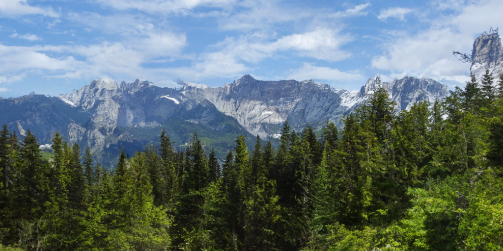

# [Patched Denoising Diffusion Models For High-Resolution Image Synthesis (ICLR 2024)](https://arxiv.org/abs/2308.01316) 

Zheng Ding\*, Mengqi Zhang\*, Jiajun Wu, Zhuowen Tu 



This code is for the 1k-resolution image generation using Patch-DM.

## Environment Setup

Please run the following command to install the environment.

```
pip install -r requirements.txt
```

## Data Preprocessing

We provide the scripts converting images to lmdb for training.

```
python img2lmdb.py --input ${input_img_path} \
  --output ${lmdb_path}
```

## Train Patch-DM
To initialize semantic code for global style consistency, we need to extract image embedding from CLIP pretrained model first and optimize it during training. The following code will generate initial semantic codes for training.

```
python initialize.py --data_path ${data_path} \
  --out_path ${semantic_pt_file_path}
```

Code for training is provided in `train.py`, image size should be divisible by patch size. In our experiments, we adopt 64 for patch size. Example:

```
python train.py --batch_size 64 \
  --patch_size 64 \
  --data_path ${lmdb_path} \
  --name exp \
  --semantic_path ${semantic_pt_file_path}
```

## Train Latent Model

In our unconditional image generation, a latent diffusion model is trained on optimized semantic code embedding space for providing infinite new global semantic conditions. To train latent model, we directly derive semantic embedding layers from model without additional inference. Code is provided in `train_latent.py`, run the following command for training:

```
python train_latent.py --name exp_latent \
  --model_path ${Patch-DM_model_path} 
```


## Inference


We provide the script below for inference. 

```
python test.py --batch_size 1 \
  --patch_size 64 \
  --output_dir ${img_save_path} \
  --image_size ${height}x${width} \
  --full_path ${Patch-DM_full_model_path} \
```

## Citation

```
@inproceedings{ding2024patched,
  title={Patched Denoising Diffusion Models For High-Resolution Image Synthesis},
  author={Zheng Ding and Mengqi Zhang and Jiajun Wu and Zhuowen Tu},
  booktitle={The Twelfth International Conference on Learning Representations},
  year={2024}
}
```

## Acknowledgement

This project leverages knowledge from the following amazing works:
[DiffAE](https://github.com/phizaz/diffae),
[Guided Diffusion](https://github.com/openai/guided-diffusion).
